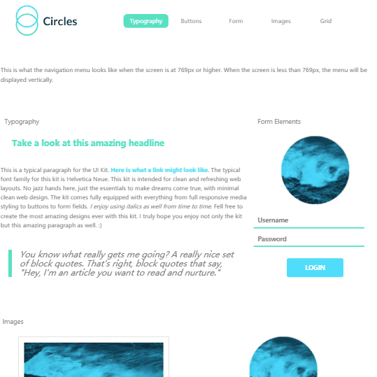

# treehouse-frontend-project04
TreeHouse FrontEnd Project 4 - Web style guide

[Click here](https://canpu.github.io/treehouse-frontend-project04/) to view the demo

## Brief Introduction

* The webpage is an style guide page.
* The page has adopted a mobile first responsive design.
* The page demonstrates differences in typography, buttons, forms, images and grid.
* The grid system section highlights the widths of different grid classes. They all collapse to an entire row when the viewport width is smaller than 1400 pixels.

## Techniques Involed

* HTML
* CSS
* Sass
